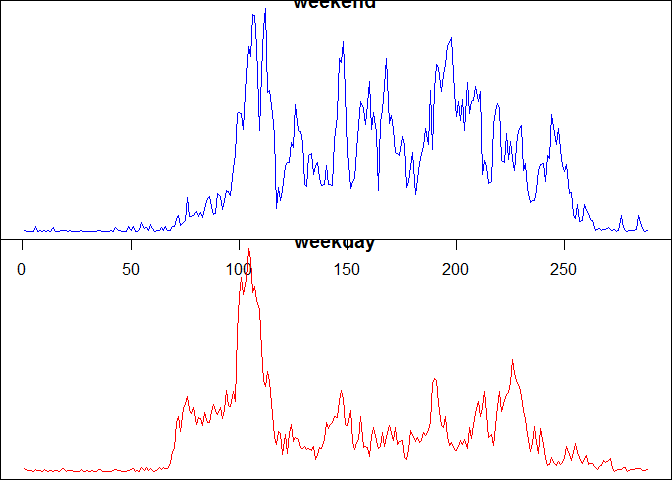

# Reproducible Research: Peer Assessment 1


## Loading and preprocessing the data

```r
data <- read.csv("activity.csv")
```


## What is the mean total number of steps taken per day?

### Total number of steps taken per day

```r
dataSum <- with(data, tapply(steps, date, sum))
hist(dataSum, main = "Histogram on the total number of steps taken per day", xlab = "", col = "turquoise", border = "blue", labels = T)
```

 


### Mean number of steps taken per day

```r
mean(dataSum, na.rm = T)
```

```
## [1] 10766.19
```

### Median number of steps taken per day

```r
median(dataSum, na.rm = T)
```

```
## [1] 10765
```


## What is the average daily activity pattern?

```r
dataAvgIntv <- with(data, tapply(steps, interval, mean, na.rm = T))
plot(dataAvgIntv, type = "l", xlab = "Index of 5-minute intervals", ylab = "Avg no. of steps taken, avg-ed across all days", main = "Time series plot of 5-minute interval", col = "blue")
```

 

### The 5-minute interval with the most number of steps averaged across all days is:

```r
names(dataAvgIntv[dataAvgIntv == max(dataAvgIntv)])
```

```
## [1] "835"
```


## Imputing missing values

### The number of NA entries in the steps variable is:

```r
nrow(data[is.na(data$steps),])
```

```
## [1] 2304
```

### Missing data is imputed by filling them up with the mean number of steps of the corresponding 5-minute interval

```r
data2 <- data
for (i in 1:nrow(data2)) {
        if (is.na(data2$steps[i])) {
                data2$steps[i] <- dataAvgIntv[match(data2$interval[i], names(dataAvgIntv))]
                      
        }  
}
```

### Re-generating histogram, mean, and median again using new dataset:

### Total number of steps taken per day:

```r
dataSum <- with(data2, tapply(steps, date, sum))
hist(dataSum, main = "Histogram on the total number of steps taken per day", xlab = "", col = "magenta", border = "purple", labels = T)
```

 


### Mean number of steps taken per day:

```r
mean(dataSum, na.rm = T)
```

```
## [1] 10766.19
```

### Median number of steps taken per day:

```r
median(dataSum, na.rm = T)
```

```
## [1] 10766.19
```

### Impact of imputation:
The peak of the histogram became larger, from 28 to 36.
The mean and median of the total number of steps taken per day became equal compared to that before the imputation where the median is smaller than the mean.

## Are there differences in activity patterns between weekdays and weekends?

### First, formating imputed dataset to include day and week values and load create panels

```r
data2$date <- as.Date(data2$date)
data2$day <- weekdays(data2$date)
data2$week[(data2$day == "Sunday" | data2$day == "Saturday")] <- "weekend"
data2$week[!(data2$day == "Sunday" | data2$day == "Saturday")] <- "weekday"
```

### Second, split data into weekend and weekday datasets

```r
dataWeekends <- data2[(data2$day == "Saturday" | data2$day == "Sunday"),]
dataWeekdays <- data2[!(data2$day == "Saturday" | data2$day == "Sunday"),]
```

### Third, examine the differences between weekend and weekday datasets

```r
dataAvgWE <- with(dataWeekends, tapply(steps, interval, mean, na.rm = T))
dataAvgWD <- with(dataWeekdays, tapply(steps, interval, mean, na.rm = T))

par(mfrow = c(2,1), mar= c(0,0,0,0))
plot(dataAvgWE, type = "l", xlab = "", ylab = "", col = "blue", main = "weekend")
plot(dataAvgWD, type = "l", xlab = "", ylab = "", col = "red", main = "weekday")
```

 

### Observation:
Steps taken in weekends are more broadly distributed than that in weekdays.


---------

